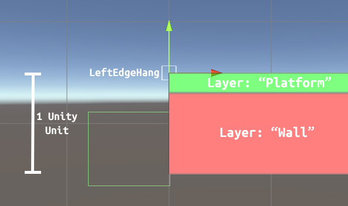

# Adding a new stage to _Second Floor Smash_
## Part 1: Creating the new scene
1. Go to the Assets/Scenes folder and duplicate the scene called "ProvingGround" with CTRL/CMD+D. ProvingGround is the blank default stage that any new stage can build from to keep things simple.
2. Rename your copy of the ProvingGround scene to whatever you want to call your stage, then double-click to open it.
3. In the scene, you will find a GameObject called "StageManagement". Don't touch that or any of its children (yet).
4. Aside from StageManagement, the only other top-level GameObject you will find is "Platform." This is obviously the single platform that is in ProvingGround. You can delete this if you want, but you might want to refer to it while reading Part 2 below.
## Part 2: Customizing your stage's layout
1. In a stage, all GameObjects that the characters should be able to walk on should follow these conventions:
    1. The GameObject's Transform's _Z_ position should be 0.
    2. The GameObject (or one of its children) should have (a) BoxCollider2D component(s) spanning all edges of the platform that a character should be able to walk on, but should _not_ reach the depth of the bottom of the platform (see the Platform GameObject in ProvingGround for an example).
        1. This GameObject's layer should be set to "Platform".
    3. The GameObject should have a child or children GameObject(s) called "Wall" containing (a) BoxCollider2D component(s) that reaches all edges of the platform that the character should _not_ be able to walk on. This includes the bottom and the sides of a platform.
        1. This GameObject's layer should be set to "Wall".
    4. All edges/corners that a player should be able to grab and hang onto if falling/jumping should be marked with an instance of either the LeftEdgeHang prefab or the RightEdgeHang prefab depending on whether the edge/corner is facing the left or the right.
        1. The Left/RightEdgeHang prefabs can be found in the Assets/Stages/Shared Stage Assets folder.
        2. Add an instance of the appropriate EdgeHang prefab to your scene so that it is a child of your platform, and line up the instance's "center" (the Transform gizmo) on the edge/corner of your platform. Make sure the _Z_ position of the Left/RightEdgeHang instance remains at 0.
        

        
2. Feel free to add other things to your stage. Create a new folder with your stage's name as a subfolder in Assets/Stages and keep any assets you add to the project for your stage in there.
3. If you create new types of platforms or obstacles or stage-related scripts or something fancy that you think could be useful in other future stages, put them in Assets/Stages/Shared Stage Assets.
#### Note: to test your stage with one character, simply enter play mode while in your stage's scene. To test with more than one character at a time, you'll need to complete Part 4 of this guide and then run the game from the Hub scene and select the stage from the Stage Select screen.
## Part 3: Updating StageManagement
If your stage is significantly bigger or smaller than ProvingGround, you'll want to change the boundaries.

1. Expand the "StageManagement" GameObject, and then expand the "CameraTargets" GameObject.
2. CenterCameraTarget's _X_ and _Y_ positions should put it approximately in the center of the stage, LeftCameraTarget should be located about 75% of the distance from CenterCameraTarget to the intended left boundary of the stage, and RightCameraTarget should be located about 75% of the distance from CenterCameraTarget to the intended right boundary of the stage. Just do trial and error and feel free to add more targets if necessary.
3. Select the "GameplayManager" GameObject. On the attached GameplayManager component, set the "Up Boundary" field to be the maximum _Y_ height that a character can reach before being KO'd, set the "Down Boundary" field to be the maximum _Y_ depth that a character can fall downward before being KO'd, and set the "Side Boundary" field to be the maximum distance to the left or right that the character can reach before being KO'd.
4. Expand the "InitialPositions" GameObject and move the positions of its four children to appropriate spots to spawn four player at the start of a round in this stage. Keep in mind that the center of each of these child GameObjects will be located at the feet of the spawned players.
### Adding Music:
1. The GameObject called "StageMusic" is where you specify what music you want for your stage. Expand the Music array in the StageMusic component on the StageMusic GameObject and drag in any audio clips you want to play. If "Shuffle" is not checked, they'll play on loop in the order you specify.
2. Inside Assets/Stages/"Shared Stage Assets", there is an Audio Mixer called "TemplateMixer". Use Ctrl-D to duplicate this Audio Mixer, then put the newly-created duplicate in your new stage's subfolder within Assets/Stages.
3. Rename this Audio Mixer to "<your stage's scene name>Mixer". For example, the default demo stage is called "Proving Ground," but its scene name is "ProvingGround," so its Audio Mixer is named "ProvingGroundMixer".
4. Go to the StageMusic gameObject in your scene. Click the circle within a circle icon for the "Output" property to get a list of possible audio mixer groups. Select the audio mixer group called "Music" within your audio mixer.
5. Explanation: With your stage's audio mixer, you can adjust the volume of the music vs. the character sound effects without affecting all the rest of the stages. When they enter the scene, the characters will automatically set their audio mixer groups to be your stage's audio mixer's "CharSoundFX" group. You can also add additional groups for other sound effects from other things in your stage if you would like to be able to mix their audio easily as well.
## Part 4: Adding your stage to the Stage Selection menu
1. Within your stage's scene, go to File->Build Settings (CTRL+Shift+B), and then click "Add Open Scenes." This will add your new stage's scene to the "Scenes in Build" list and assign your scene an index.
2. Go to the Hub scene.
3. In the hierarchy, find the "StageSelectCanvas" GameObject (a child of "CharacterSelect") and double-click it to view the Stage Select menu.
4. You will see the icons of the current stages listed under the "StageIcons" GameObject. Select the "Proving Ground" icon GameObject in the hierarchy, use CTRL/CMD+D to duplicate it, then rename the duplicate to be your scene's name.
5. Move your newly-created duplicate so that it is no longer overlapping the Proving Ground icon. You can move around or resize the other stage icons if you need to make room.
6. Select your stage's new icon. In the Inspector, find the attached StageIcon script, and change the "Stage Name" field to your stage's name and the "Stage Index" to your stage's index in the build list (you can check this by again going to File->Build Settings (CTRL+Shift+B).
7. Go to Assets/Hub/StageSelect/StageIcons. In this folder, there will be a .PSD file imported as a sprite called "stage_icon_template". Duplicate this file and double-click it to open it in Photoshop.
8. Edit the template to represent your stage by adding a screenshot of your stage. An easy way to get a nice screenshot of your stage is to enter play mode in your stage's scene, pause the game, deactivate all UI and the character, reposition the camera to get a nice full view of your stage, and then take a screenshot or screen clipping. Do this in playmode so that your changes to the scene by messing with the camera will be reverted automatically when you exit play mode.
9. Save your icon in Photoshop and then drag your icon sprite to the "Source Image" field of your stage's icon GameObject's Image component.

_Congratulations, you have finished adding a stage in Second Floor Smash!_
