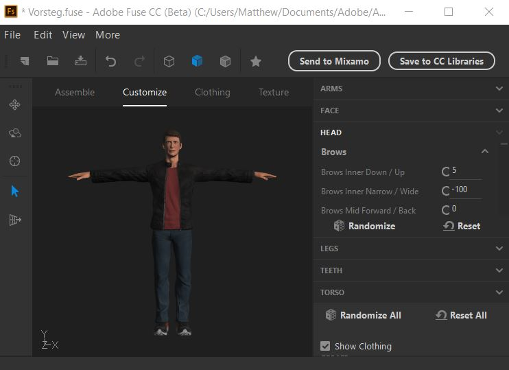
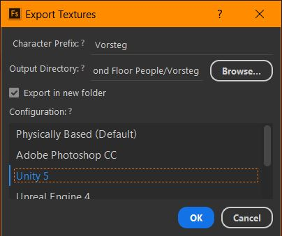

# _Second Floor Smash_
A _Super Smash Brothers_ clone using custom assets enabling a wider variety of characters and stages. It is a work-in-progress.

Note that this currently requires a USB gamepad to play. Upon running the game, press any button on each gamepad to get a character selection hand and token for each player, and select your characters. Press the right bumper on the gamepad to change your character's skin. Press the start button to begin the game and press the select button to return to the character selection screen.

## Adding your own character to _Second Floor Smash_
#### One of the main goals of this project is to make it as easy as possible for anyone to add their own custom characters to the game. This will be a guide for the process I use to do so, from creation of the character model to inclusion in the game to updating the character selection screen. This guide assumes that you have a basic understanding of the Unity game engine and that you have already cloned the repository.
### Part 1: Creating your character's model
Depending on what kind of character you aim to include, there are many different ways you could go about creating your character's model. You could manually create it using software such as Blender, you could download a premade character off the Internet, or you could use a character creation software such as Adobe Fuse to create your character's model. This third option is the option I went with for creating my characters, and this is what we will be exploring in this part of the guide.
1. Install Adobe Fuse. Fuse is available for free from Adobe, and its installation instructions can be found on Adobe's website [here](https://www.adobe.com/products/fuse.html).
2. Run Adobe Fuse.
    1. This may be harder than it sounds. There are several known bugs with Adobe Fuse that Adobe has neglected to resolve, one of which is opening the program, as simply running it as you would any other application often fails to yield results. As discussed [here in an Adobe Support forum](https://community.adobe.com/t5/fuse-beta/fuse-won-t-start/m-p/8247719?page=1#M260), the most reliable way to open Fuse is to click rapidly on its icon within the Adobe Creative Cloud Desktop application.

3. Within Fuse, create your character.
    1. Start with the "Assemble" tab. Here, you will pick the character model you will start with, by choosing the desired head, torso, legs, and arms.
    2. In the "Customize" tab, you can adjust the many sliders that are listed in order to adjust your character's facial features and body proportions.
    3. Next, the "Clothing" tab allows for the choice of what (if any) shirts, pants, hair, hats, glasses, shoes, etc. that you would like your character to wear.
    4. Finally, the "Texture" tab allows you to adjust the color, albedo, pattern, and roughness of your character's body, hair, or clothes. Simply click on the part of your character that has the textures you would like to adjust, and you will be given a list of applied textures and their properties in the panel on the right side of the window. To replace a texture with another texture entirely, select the texture you wish to replace by clicking on it in the right panel, and then click on the texture you want it to be replaced with from the available textures displayed in the panel at the bottom of the window.
4. If you are unsatisfied with the available choices of character models and clothing, you can find many more options in Mixamo Fuse, the version of Fuse that existed before Mixamo was purchased by Adobe. [Mixamo Fuse is available for free on Steam](https://store.steampowered.com/app/257400/Fuse/), however, Adobe Fuse will be required to properly import a character into _Second Floor Smash_. In order to still use Adobe Fuse while taking advantage of the wider selection of characters and clothing available in Mixamo Fuse, there is an excellent walkthrough [available here](https://www.youtube.com/watch?v=883HyMmnSQI) on transferring content from Mixamo Fuse to Adobe Fuse.
### Part 2: Preparing your character for import into Unity
#### Now that we've created a custom character, we need to first extract its textures and rig the character so that it may be animated.
1. First, we must export our character from Adobe Fuse. We will begin by exporting the character's textures.
    1. In Adobe Fuse, go to File->Export->Export Textures.
    
    
    
    
    
    2. A new window will appear. Enter the desired Character Prefix (usually just the character's name), select your desired output directory, ensure that the "Export in new folder" option is checked, and set the "Configuration" to be "Unity 5." Then click "OK."
    3. This will create a new folder containing all of your character's textures within the selected output directory, the title of which will be the Character Prefix that you specified.
2. Next, we will send our character to [Mixamo](https://www.mixamo.com/#/) to be rigged, essentially allowing for the character to be animated.
    1. Within Adobe Fuse, click the "Send to Mixamo" button. 
    2. A window will appear prompting you to enter a name for your character. Use the same name that you gave for the Character Prefix when exporting the character's textures, and then click "Save."
        1. Note that this will not work if you are using an Adobe Enterprise account (one paid for by your school or company). For reasons unknown, Mixamo currently only works with a personal Adobe account. If you are logged into an Enterprise account, use the Adobe Creative Cloud Desktop application to log out of it and log into a personal account. It is inconsequential if you do not have a paid personal Adobe Creative Cloud subscription, as Adobe Fuse is free to all accounts. You will need to restart Adobe Fuse if you switch accounts.
    3. A tab in your computer's default Internet browser will open to Mixamo's website. You will see a gray box with a loading animation, and the words "Auto-Rigging." This is where Mixamo creates a "skeleton" for your character so that it can be animated.
    4. When the auto-rigging is complete, you will see your character standing in the window, looking around. Click "Finish."
    5. On the next page, Mixamo will prompt you to either download or animate your character. Since the animations we will be using are already in _Second Floor Smash_, we will click "Download."
        1. When prompted, set the format to "FBX for Unity(.fbx)," and leave the pose as "T-pose." Then click "Download."
    6. Put your downloaded FBX in the same directory that the folder of your character's textures is located within.
        1. _IMPORTANT_: Do not put the FBX in the folder _with_ the textures, rather, put the FBX in the folder that houses the folder with the textures.
### Part 3: Add your character to _Second Floor Smash_
#### After rigging our character and obtaining its textures, it is time to import the character into our Unity project and give it all the properties that a playable character in the game has.
1. Open the _Second Floor Smash_ Unity project if you haven't already. Make sure that you are in the scene titled "CharacterSelect."
2. The project has been set up to use the script available [here](https://forum.unity.com/threads/script-for-importing-adobe-fuse-character-model-into-unity-fixes-materials.482093/) for properly importing characters that were created with Adobe Fuse. This script provides us with the "Mixamo" drop-down in the toolbar at the top of the window.
3. Click Mixamo->Import Character. A file explorer window will appear prompting you to select your character's FBX file.
    1. Assuming that your character's folder of textures is located within the same directory as the FBX and has the same filename, the folder full of textures will be imported with the character, and materials reflecting the character's appearance within Adobe Fuse will automatically be created.
4. Once the character has been imported, the character will appear within your scene as the child of a newly created GameObject called "Mixamo." You can delete the Mixamo GameObject and its child (your character) from the hierarchy, as we will not be using them.
5. Within the Assets folder in the project explorer, navigate to the folder called "Characters." In this folder, you will find a folder for each character currently in the game.
6. Select one of the character folders and use Ctrl-D to duplicate it. Rename this duplicate to your new character's name.
    1. By duplicating an existing character's folder, we can take advantage of the work that has already been done to create our character, rather than doing everything from scratch.
7. Enter the new folder for your character that you just created. Inside that folder, you will find all of the contents of the folder that was duplicated to create this folder, including an animation controller and at least one prefab for the character whose folder you duplicated. Delete everything in this folder except for the animation controller and one character prefab.
8. Rename both the animation controller and the character prefab to your character's name. Then, double-click on the prefab to open it.
9. With the GameObject at the top of the prefab's hierarchy selected, you will see a component in the Inspector called "Animator." One of the Animator component's fields is "Controller." Drag the animation controller with your character's name on it to this field.
10. Leaving the prefab open, navigate back to the top of the Assets folder, and then enter the folder called "Mixamo." This is the folder in which the resources for all imported Adobe Fuse characters are stored. Within the Mixamo folder, find your character's folder and enter it.
11. As it is now, your currently open prefab has the character model of a character that is not your character. Before we remove this character's model from the prefab and replace it with our own, the "Shield" GameObject must first be extracted from the old model so that it can be placed within the new model.
    1. If it is not already expanded, expand the GameObject called "Body" in the prefab's hierarchy. One of its children will be called "mixamorig:Hips." Expand this child.
    2. One of the children of the "mixamorig:Hips" GameObject will be called "Shield." Drag this "Shield" GameObject out from the "mixamorig:Hips" GameObject so that its immediate parent is the top-level GameObject that has your character's name.
12. Delete the GameObject called "Body" with all of its children. This will remove the previous character model from the prefab.
13. Within your character's folder in the "Mixamo" folder, you will find a folder called "Materials," a folder called "Model," a folder called "Textures," and a prefab with your character's name. Drag this prefab into the currently open prefab's hierarchy. This will add your character's model to the prefab.
14. Once your character's model has been added to the open prefab, you will notice that it appears as a prefab instance (highlighted in blue) in your hierarchy. Right-click on this prefab instance and select the option of "Unpack Prefab Completely." Then expand your newly unpacked prefab to view its children.
15. Of the newly unpacked prefab's children, use Shift-click or Ctrl-click to select each child except for the one named "Body," and then drag them so that they are all made a child of "Body."
16. Drag the child called "Body" so that its parent is the top-level GameObject of the prefab's hierarchy. Then delete Body's former parent (which should have your character's name on it) from the hierarchy, as now should have no children or attached components.
17. Click on the Body GameObject. Within the Transform component within the Inspector, change the Y-value of the Rotation field from 0 to 90. This will rotate your character 90 degrees.
18. Drag the "Shield" GameObject so that it is the immediate child of the "mixamorig:Hips" GameObject in the hierarchy. This will tie the position of the shield to the movement of the character's torso when the character performs its shield action in the game.
19. Click on the GameObject at the top of the hierarchy. Change the GameObject's tag to be the character's name.
### Part 4: Update the Character Selection screen
#### While completion of Part 3 will give you a playable character, we must first update the character selection screen so that it is actually possible to select that character from within the game.
1. Exit the opened prefab to return to the view of the scene called "CharacterSelect."
2. In the hierarchy, expand the "Canvas" GameObject, and then expand the "CharacterIcons" GameObject.
3. Duplicate one of the children of CharacterIcons and rename it appropriately. This duplicate will be initially located on top of one of the existing icons. Modify the position values of its "Rect Transform" component to move it so that it is no longer in the way of any other icons.
    1. You may want to consider rearranging all of the icons using this method to accommodate the addition of your new character.
4. Change your character's icon's GameObject's tag so that it is the name of your character.
5. From the top of the Assets folder, go to Assets/Character Select/Icons. Within this Icons folder is each character's icon for the character select screen. One of these icons is titled "template." Use Ctrl-D to duplicate this template, rename the duplicate, and then double-click it to open it in Adobe Photoshop (its filetype is already a .psd). Edit it as appropriate to represent your new character.
6. Click on the GameObject for the new character icon that you made in the hierarchy. It will have an "Image" component with a field called "Source Image." Drag your newly edited character icon from the Icons folder into this field. This will give your character's icon on the character selection screen its distinctive appearance.
7. Find and select the GameObject called "CharacterManager" in the hierarchy. There will be a script attached to it called "Character List." Right-click this script, and then select "Edit Script" to open it in your IDE.
8. In the CharacterList.cs script, you will see a series of declarations of public GameObject arrays and public floats, one of each for each character. Add one of each for your new character, like so:

        public GameObject[] NewCharacter;
        public float NewCharacterHeightOffset;

9. Scroll down until you reach the `void Start()` function. Within this function, you will find a series of statements adding to a dictionary called `characters` and a dictionary called `heightOffsets`. Add a statement adding your character's public GameObject array and your character's public float that you declared in the last step to `characters` and `heightOffsets`, respectively. For each dictionary's key, enter the exact string that you used for your character's tag that you assigned to your character's icon. For example:

        characters.Add("New Character", NewCharacter);
        heightOffsets.Add("New Character", NewCharacterHeightOffset);

10. Save the script and return to the Unity window, with the CharacterManager GameObject again selected.
11. In the Inspector, you should now see a new field appear on the Character List script component for both your character's GameObject array and your character's height offset.
12. Navigate to Assets/Characters and then enter the folder you created for your character, where your character's prefab is stored. Expand your character's GameObject array in the Character List script component in the Inspector, set the size of the array to 1, and then drag your character's prefab into the GameObject field that appears.
    1. Note: if you ever create alternate skins/outfits for your character, simply expand the size of the array and drag them into the slots to add them to the game.
### Part 5: Final adjustments
#### At this point, if you click the play button to run the game, you will be able to select your character and play as that character in the game. However, there are two minor adjustments that may need to be made.
1. First, we will make sure that the character's feet are actually on the ground. Because not all characters are the same height, the duplication and modification technique we used to create our new character leaves it with the same collider size that the character it was copied from had, which is often the wrong size for the new character.
    1. Click the play button, and then select your character with your gamepad. You will see the model of your character appear below the character icons on the character selection screen.
    2. Without pausing the game or exiting play mode, switch tabs from the Game view to the Scene view.
    3. In the hierarchy, expand the GameObject called "P1 Podium." One of its children will be an instance of your character's prefab. Double-click on this GameObject in the hierarchy to fly directly to it in the scene view, and then adjust your view so that you can see whether or not your character's feet are touching the podium.
    4. If the bottoms of your character's feet seem to be appropriately touching the podium, you can move on to the next step of Part 5. Otherwise, expand the instance of your character's prefab and click on the child GameObject called "StandingCollider."
    5. The StandingCollider GameObject is responsible for keeping your character from falling through the floor. Ideally, in your character's neutral animation state (which your character should be in when viewed on the character selection screen), the bottom of your character's StandingCollider should line up with the bottom of your character's feet. If the collider's bottom is too high above your character's feet, your character's feet will have sunk into the floor (in this case, the podium), and if the collider's bottom is too low below the feet, your character will appear to be floating above the floor/podium.
    6. To adjust the standing collider so that it lines up with the character's feet, adjust the StandingCollider's "Capsule Collider 2D" component's "Offset" field's y-component along with the "Size" field's y-component. The Offset field dictates the altitude of the collider on the character, and the Size field dictates the size of the collider as a whole. You should be able to adjust the values of these fields through trial and error so that the bottom of the collider lines up with the character's feet and the top of the collider lines up with the character's head.
    7. Once you are satisfied with your adjustment of the StandingCollider, right-click the Capsule Collider 2D component and click "Copy Component." Then exit play mode. It is important to copy the Capsule Collider 2D component while still in play mode because any changes you make to a Unity project while in play mode are lost as soon as you exit play mode.
    8. Navigate to your character's prefab within your character's folder in Assets/Characters and double-click to open it. Find and select the StandingCollider GameObject in the prefab's hierarchy.
    9. Right-click on the Capsule Collider 2D component within the Inspector and click "Paste Component Values." This will give our character's StandingCollider the offset and size adjustments that it had while in play mode so that the character's feet will be appropriately grounded.
2. After adjusting the StandingCollider, the final adjustment that may need to be made is the character's preview height. When a character is selected on the character selection screen and the preview model appears, without proper adjustment, the character may be so tall that they are partially obscured by the character selection icons, or they might be too short to be adequately seen. To remedy this, each character has a unique offset that is applied to the podium they stand on in the character selection screen.
    1. Click the play button to enter play mode. Use your gamepad to select a character other than your own and note the approximate distance between the top of the character's head and the bottom of the character selection icons. Then select your character and compare the distance between the top of their head and the bottom of the character selection icons to that of the other character.
        1. If the distances are approximately the same, then you've finished adding your character to _Second Floor Smash_.
        2. If the distances are different, then (without exiting play mode), click on the "P1 Podium" GameObject, and then adjust the y-component of the position field in the P1 Podium GameObject's Transform component until your character's head appears to be at an appropriate height in the game view.
    3. Calculate the difference between -1.5 (P1 Podium's default y-coordinate) and its new y-coordinate. Do not take the absolute value. For example, if the new y-coordinate were -1.75, then the difference would be -0.25. This is your height adjustment value.
    4. Exit play mode and select the CharacterManager GameObject in the hierarchy.
    5. In the Inspector, find your character's height offset field, and enter in your calculated height adjustment value.
3. Click the play button and select your character to verify that both adjustments are satisfactory. If that is the case, then your character has been successfully and fully added to _Second Floor Smash_!
